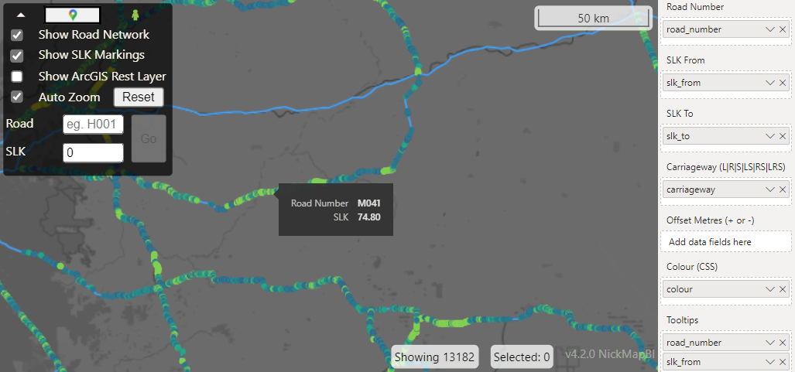

# NickMapBI <!-- omit in toc -->

Link to releases: [Releases](https://github.com/thehappycheese/nickmap-bi/releases)

Link to change log: [Change Log](./changelog.md)

- [1. Introduction](#1-introduction)
  - [1.1. Installation](#11-installation)
  - [1.2. Updating Existing Dashboards](#12-updating-existing-dashboards)
- [2. Usage](#2-usage)
  - [2.1. Required Data Format](#21-required-data-format)
    - [2.1.1. Example Data Table](#211-example-data-table)
    - [2.1.2. Column Details](#212-column-details)
  - [2.2. SLK Linear Referencing System](#22-slk-linear-referencing-system)
  - [2.3. Offset Direction](#23-offset-direction)
- [3. Related Projects](#3-related-projects)

## 1. Introduction

A custom PowerBI visual for mapping linear data on the Main Roads Western
Australia Road Network. Supports line segments with an SLK From & SLK To. Automatically generates map geometry (automates geocoding / linear referencing).

### 1.1. Installation

1. Please visit the
   [Releases](https://github.com/thehappycheese/nickmap-bi/releases) page to
   download the latest visual (At the time of writing the latest version is
   named `nickmapbi82E1C4CFA7CF45C0BC3CD8771F27FDAF.4.2.0.pbiviz`)
2. Please follow this guide to [Import a visual file from your local computer into Power BI](https://aus01.safelinks.protection.outlook.com/?url=https%3A%2F%2Flearn.microsoft.com%2Fen-us%2Fpower-bi%2Fdeveloper%2Fvisuals%2Fimport-visual%23import-a-visual-file-from-your-local-computer-into-power-bi&data=05%7C01%7CNicholas.ARCHER%40mainroads.wa.gov.au%7Ce7dad0af092c42c9894908db3fbdc0be%7Cced71ed676dd43d09acccf122b3bc423%7C0%7C0%7C638173856438541072%7CUnknown%7CTWFpbGZsb3d8eyJWIjoiMC4wLjAwMDAiLCJQIjoiV2luMzIiLCJBTiI6Ik1haWwiLCJXVCI6Mn0%3D%7C3000%7C%7C%7C&sdata=2%2FrjQ0eX8u2uM3X6jLIyriKPQjyomBllicjSBd%2BZkqs%3D&reserved=0).

### 1.2. Updating Existing Dashboards

To update any existing dashboards with a newer version of this visual, the
process is exactly the same as installing it for the first time. PowerBI will
prompt you to confirm, then it will replace all existing instances of the
NickMap visual in the report with the new version. Each of your reports must be
individually updated and republished this way.

## 2. Usage

### 2.1. Required Data Format

#### 2.1.1. Example Data Table

| Road Number | Carriageway | SLK From | SLK To | Offset (Metres) | Color (CSS) | Tooltip (1) | Tooltip (2)          | ... |
| ----------- | ----------- | -------- | ------ | --------------- | ------------ | ----------- | -------------------- | --- |
| H001        | LS          | 0.00     | 1.2    | 0.0             | "green"      | "low"       | "Some comment"       | ... |
| H001        | LS          | 1.20     | 1.3    | 0.0             | "yellow"     | "medium"    | "Some other comment" | ... |
| H001        | RS          | 0.00     | 1.2    | `0.0            | "#FF0000"    | "high"      | "Some other comment" | ... |

#### 2.1.2. Column Details

| Field Well            | Optional | Accepts Multiple Columns | Description                                                                                                                                                                                                                                                                                                                                                                                                                                                                                                                                                                              |
| --------------------- | :------: | :----------------------: | ---------------------------------------------------------------------------------------------------------------------------------------------------------------------------------------------------------------------------------------------------------------------------------------------------------------------------------------------------------------------------------------------------------------------------------------------------------------------------------------------------------------------------------------------------------------------------------------- |
| Road Number           |    No    |           No*            | State Road numbers (eg `H001`), PSP numbers (eg `P016`), Proposed Road Numbers (eg `PROP.H064`) Local road numbers such as `1180505`                                                                                                                                                                                                                                                                                                                                                                                                                                                     |
| SLK From (kilometres) |    No    |           No*            | Start position of the datapoint (See description of [SLK](#slk-linear-referencing-system) below)                                                                                                                                                                                                                                                                                                                                                                                                                                                                                         |
| SLK To (kilometres)   |    No    |           No*            | End position of the datapoint (See description of [SLK](#slk-linear-referencing-system) below)                                                                                                                                                                                                                                                                                                                                                                                                                                                                                           |
| Carriageway           |   Yes    |           No*            | Zero to three letters indicating the selected carriageways to be used as the road centreline for this datapoint.  Any combination or permutation of the letters `L`, `R`, `S` will work (Selecting for Left, Right and Single carriageways respectively). If left blank, the default behaviour is the same as `LRS` which selects all carriageways. When plotting data on the left of a road it is recommended that `LS` is used, such that if the road network alternates between dual and single carriageway your data will still be plotted.  `RS` can be used for data on the right. |
| Offset (Metres)       |   Yes    |           No*            | Offset the linestring(s) after the road network centreline(s) is/are sampled. Positive values offset to the right hand side. Negative values offset to the left hand side. (See [Offset Direction](#offset-direction) Below)                                                                                                                                                                                                                                                                                                                                                             |
| Color (CSS)          |   Yes    |           No*            | For example `red` or `#FF0000` or `rgb(255,0,0)` or `rgba(255,0,0,0.5)`. Sets the color of each linestring shown on the map. If a blank or invalid CSS color is used the linestring will probably be black. See <https://developer.mozilla.org/en-US/docs/Web/CSS/color_value> for more information about CSS color values.                                                                                                                                                                                                                                                           |
| Tooltip(s)            |   Yes    |           Yes            | Any tooltip text                                                                                                                                                                                                                                                                                                                                                                                                                                                                                                                                                                         |

> *NOTE: There is a known issue regarding the number of columns accepted by each
> field-well; For example PowerBI will let you drop multiple columns into the
> `Road Number` field-well, but only one of those columns will be used. The
> visual is supposed to restrict the field-wells to accept only the correct
> number of columns but currently it does not.

### 2.2. SLK Linear Referencing System

SLK stands for "Straight Line Kilometres". It is a system of measurement for
positions along a road. SLK is measured from the start of the road along the
centreline, with several important asterisks:

- SLK is 'preserved' when the length of a road changes due to realignment
- To accommodate this, there are gaps and overlaps known as "Points of Equation"
  or POEs at several points along most roads.
- In a POE overlap, SLK does not uniquely identify a single location
- There are approximately 200 POEs on the network, varying in size from a few metres up to a 1 kilometre.
- Left and Right carriageways each have their own SLK referencing system however
  these are almost always aligned within 20 metres or so
- SLK may not start from 0; for example Great Northern Highway H006 starts from SLK 3.17.

> The "True Distance" referencing system is a true measure of distance along the
> centreline without POE adjustments (may still have gaps though). This system
> of measurement is not available though this PowerBI visual (yet).

### 2.3. Offset Direction

The "Left Hand Side" of a road means "the drivers left hand side when travelling
in the direction of increasing SLK"

The "Right Hand Side" of a road means "the drivers right hand side when
travelling in the direction of increasing SLK"

The Offset column in this visual takes either positive or negative values:

- Positive values offset to the right hand side, and
- Negative values offset to the left hand side

## 3. Related Projects

This project relies on a related project https://github.com/thehappycheese/nicklinref_rust